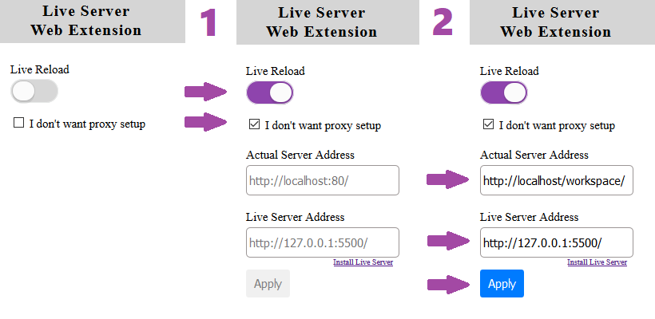

# Setup
#### The Common Misconception
Neither the browser add-on nor the VS Code extension will host a server for: `PHP`, `.NET` or `NodeJS`. It will give you the *reloading function*, so you do not need to refresh the page every time you save.

In other words. If you just want the reload feature when working with .html files, then you do not need this add-on at all.

<br>

***Need Help? [Watch Video Tutorial](https://www.youtube.com/watch?v=54wcX1G2GH8)***  

<br><br>

# Direct Setup<sup><sub><sup>`Easy`</sup></sub></sup> || Proxy Setup<sup><sub><sup>`Advanced`</sup></sub></sup>

### Direct Setup

1. Install [VS Code](https://code.visualstudio.com/download) from Microsoft. <sup>(code editor)</sup>
2. Install VS Code [Live Server](https://marketplace.visualstudio.com/items?itemName=ritwickdey.LiveServer). <sup>(extension to code editor)</sup>
3. Install the browser add-on; [Chrome](https://chrome.google.com/webstore/detail/live-server-web-extension/fiegdmejfepffgpnejdinekhfieaogmj/) or [Firefox](https://addons.mozilla.org/en-US/firefox/addon/live-server-web-extension/).
4. Install and run a server on your machine: [Servers and Frameworks](#servers-and-frameworks)
5. Place your app on the server you want to use and open your project there.
6. Enter the neccesary fields (screenshot below)
    1. **Actual Server Address:** is the address where your server is located and the port.
    2. **Live Server Address:** is the address where your VS code extension is running.
7. Push the `Go Live`-button in your editor's statusbar.
8. Visit the `Actual Server Address`



<br><hr>

### Proxy Setup
1. Install [VS Code](https://code.visualstudio.com/download) from Microsoft. <sup>(code editor)</sup>
2. Install VS Code [Live Server](https://marketplace.visualstudio.com/items?itemName=ritwickdey.LiveServer). <sup>(extension to code editor)</sup>
3. Install the browser add-on; [Chrome](https://chrome.google.com/webstore/detail/live-server-web-extension/fiegdmejfepffgpnejdinekhfieaogmj/) or [Firefox](https://addons.mozilla.org/en-US/firefox/addon/live-server-web-extension/).
4. Install and run a server on your machine: [Servers and Frameworks](#servers-and-frameworks)
5. Place your app on the server you want to use and open your project there.
6. Enter the neccesary values (code block below)
    1. **enable:** whether it is enabled or not.
    2. **baseUri:** is the path to the folder you want proxy from. The path is relative to the workspace.
    3. **proxyUri:** is the address where your server (xampp or similar server) is located, and the port.
7. Push the `Go Live`-button in your editor's statusbar.

*`.vscode/settings.json`*
```js
{
    // Mainly for static files
    "liveServer.settings.useWebExt": true,

    // This means that you change your real URL (current PHP url) 
    // to another URL (which Live Sever starts).
    "liveServer.settings.proxy": {
        "enable": true,                             //   i. enabled
        "baseUri": "/",                             //  ii. workspace
        "proxyUri": "http://localhost:80/workspace" // iii. actual address
    },
}

```
>**Note:** You need to stay on the new host that will be provided by Live Server.

<br><br><br>

# Servers and Frameworks


### PHP
+ [PHP](http://php.net/downloads.php) <sup><sub>`just the preprocessor`</sub></sup>
+ [XAMPP](https://www.apachefriends.org/index.html) <sup><sub>`cross-platform`</sub></sup>
+ [MAMP](https://www.mamp.info/en/downloads/) <sup><sub>`mac`</sub></sup>
+ [WAMP](http://www.wampserver.com/en/) <sup><sub>`windows`</sub></sup>


### NodeJS
+ [ExpressJS](https://expressjs.com/en/starter/installing.html) <sup><sub>`cross-platform`</sub></sup>


### .Net
+ [DotNet Core](https://www.microsoft.com/net/learn/get-started/windows) <sup><sub>`cross-platform`</sub></sup>
+ [IIS](https://www.iis.net/) <sup><sub>`windows`</sub></sup>
